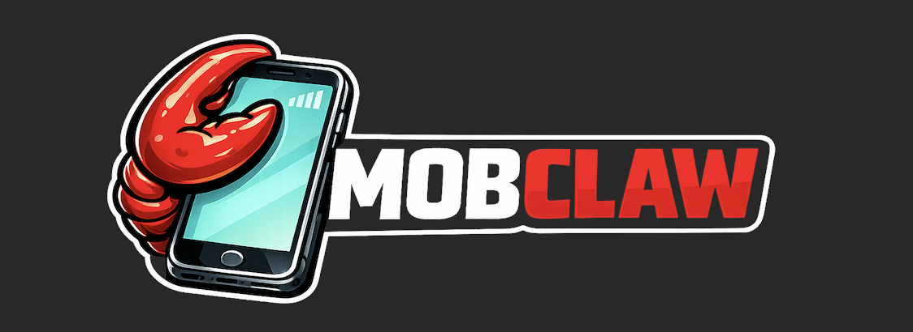

<p align="center">
  
</p>

<h1 align="center">MobClaw Android 🦀</h1>

<p align="center">
  <strong>Native Android Agent OS. Zero compromise. 100% Kotlin.</strong><br>
  ⚡️ <strong>Run autonomous LLM agents directly on-device with full Android Accessibility integration.</strong>
</p>

<p align="center">
  <a href="LICENSE"></a>
</p>

<p align="center">
  <strong>Fast, smart, and fully autonomous UI automation</strong><br />
  Drop it into any app. Let the AI take the wheel.
</p>

<p align="center">
  MobClaw is the <strong>native Android port</strong> of the ZeroClaw agent operating system — bringing true autonomous UI interaction, screen reading, and zero-shot reasoning directly to Android devices using standard Accessibility Services.
</p>

## ✨ Features

- 🏎️ **Native Kotlin Implementation:** Built from the ground up for Android, no heavy web-views or external runtimes required.
- 👁️ **Semantic Screen Reading:** Automatically transforms Android's Accessibility node tree into semantic, LLM-friendly text summaries.
- ⚡ **Real-Time Execution:** Uses Android's `AccessibilityService.dispatchGesture` for instant, reliable UI interactions (clicks, scrolls, typing).
- 🧠 **Pluggable LLM Providers:** Supports Gemini out of the box, easily extensible to any LLM provider.
- 🛡️ **Robust Error Recovery:** Built-in safeguards, auto-retry logic, and element ID resolution to handle dynamic Android UIs.

## 🚀 Quick Start

### 1. Project Setup
MobClaw is an Android library (`:mobclaw`) that you can embed into any host app (like the included `:app` test module).

Add it to your `settings.gradle.kts`:
```kotlin
include(":mobclaw")
```

Add it to your app's `build.gradle.kts`:
```kotlin
implementation(project(":mobclaw"))
```

### 2. Configure Accessibility
Your app must declare an Accessibility Service to grant MobClaw screen control.

**AndroidManifest.xml:**
```xml
<service
    android:name="com.mobclaw.android.accessibility.MobClawAccessibilityService"
    android:permission="android.permission.BIND_ACCESSIBILITY_SERVICE"
    android:exported="false">
    <intent-filter>
        <action android:name="android.accessibilityservice.AccessibilityService" />
    </intent-filter>
    <meta-data
        android:name="android.accessibilityservice"
        android:resource="@xml/accessibility_service_config" />
</service>
```

### 3. Initialize the Agent
Initialize the agent with your LLM provider and let it run tasks:

```kotlin
val provider = GeminiProvider(apiKey = "YOUR_GEMINI_API_KEY")

val agent = MobAgent.Builder()
    .provider(provider)
    .build()

// Run a task asynchronously
lifecycleScope.launch {
    val result = agent.execute("Open Settings and turn on Wi-Fi")
    println("Task finished: ${result.success} - ${result.message}")
}
```

## 🛠 Architecture

MobClaw mirrors ZeroClaw's trait-driven architecture, adapted for Android:

- **`LlmProvider`**: Interface for LLM communication (e.g., `GeminiProvider`).
- **`MobTool`**: Agent capabilities (`ClickTool`, `ScrollTool`, `TypeTool`, `ScreenReadTool`).
- **`ActionDispatcher`**: Parses LLM outputs and matches them to tools via JSON or XML.
- **`GestureEngine`**: Translates semantic node IDs to physical `Path` gestures on the screen.
- **`MobObserver`**: Hooks for rendering overlays or logging (e.g., `OverlayObserver`).

## ⚙️ How it Works

1. **Observe**: The agent calls `screen_read` to dump the current Android UI hierarchy.
2. **Reason**: The LLM parses the screen and decides what to do next based on your prompt.
3. **Act**: The LLM issues a tool call (like `click(node_id="n5")`).
4. **Execute**: MobClaw resolves "n5" to physical X/Y coordinates and dispatches a tap gesture via the Accessibility Service.
5. **Repeat**: The loop continues until the LLM calls the `finish` tool.

## 📜 License

This project is licensed under the [MIT License](LICENSE).
