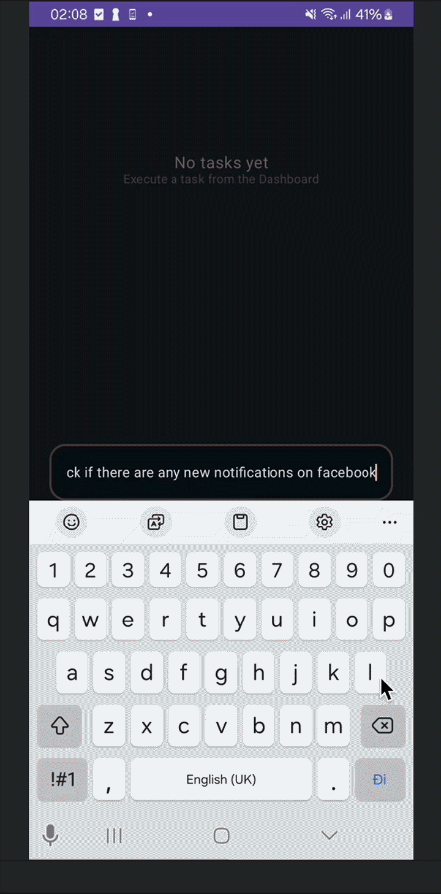

<p align="center">
  
</p>

<h1 align="center">MobClaw Android 🦀</h1>

<p align="center">
  <strong>Native Android Agent OS. Zero compromise. 100% Kotlin.</strong><br>
  ⚡️ <strong>Run autonomous LLM agents directly on-device with full Android Accessibility integration.</strong>
</p>

<p align="center">
  <a href="LICENSE"></a>
</p>

<p align="center">
  <strong>Fast, smart, and fully autonomous UI automation</strong><br />
  Drop it into any app. Let the AI take the wheel.
</p>

<p align="center">
  MobClaw is the <strong>native Android port</strong> of the ZeroClaw agent operating system — bringing true autonomous UI interaction, screen reading, and zero-shot reasoning directly to Android devices using standard Accessibility Services.
</p>

## 🎬 Demo

<p align="center">
  
</p>

## ✨ Features

- 🏎️ **Native Kotlin Implementation:** Built from the ground up for Android with Jetpack Compose — no heavy web-views or external runtimes required.
- 👁️ **Semantic Screen Reading:** Automatically transforms Android's Accessibility node tree into semantic, LLM-friendly text summaries.
- ⚡ **Real-Time Execution:** Uses Android's `AccessibilityService.dispatchGesture` for instant, reliable UI interactions (clicks, scrolls, typing).
- 🧠 **6 LLM Providers:** Gemini, OpenAI, Anthropic, OpenRouter, Ollama, and MobMock (free ChatGPT via web login) — all built-in and swappable.
- 🔧 **Native Function Calling:** Providers that support native tool calling (OpenAI, Gemini, MobMock) use it directly for faster and more accurate tool dispatch.
- 🆓 **Zero-Cost Option:** Built-in support for [MobMock](https://github.com/wamynobe/mobmock), allowing you to run agents using ChatGPT's web interface for free without API keys.
- 🛡️ **Robust Error Recovery:** Built-in safeguards, auto-retry logic, and element ID resolution to handle dynamic Android UIs.
- 🔐 **Encrypted Key Storage:** API keys are stored securely on-device using AES-256-GCM via `EncryptedSharedPreferences`.
- 📊 **Task History & Persistence:** All task results are persisted locally in SQLite — view full results, latency, iterations, and status across sessions.
- 🎨 **Professional UI:** 4-tab navigation (Dashboard, Providers, History, Overlay) with Material 3 dark theme and real-time agent status.

## 🚀 Quick Start

### 1. Clone & Build

```bash
git clone https://github.com/wamynobe/mobclaw.git
cd mobclaw
```

Open the project in Android Studio and run the `app` module on your device.

### 2. Configure Permissions

On first launch, MobClaw will prompt you to enable two permissions:

- **Accessibility Service** — grants MobClaw the ability to read and interact with the screen.
- **Overlay Permission** — allows the floating agent overlay to display status during execution.

### 3. Choose a Provider

Navigate to the **Providers** tab and configure your preferred LLM:

| Provider | API Key Required | Notes |
|----------|:---:|-------|
| Gemini | Yes | Default model: `gemini-2.5-flash` |
| OpenAI | Yes | Default model: `gpt-4o` |
| Anthropic | Yes | Default model: `claude-sonnet-4-20250514` |
| OpenRouter | Yes | Any model via OpenRouter |
| Ollama | No | Local or remote OpenAI-compatible endpoint |
| MobMock | No | Free ChatGPT via web login, default model: `gpt-5.4` |

### 4. Run a Task

From the **Dashboard** or **History** tab, type a natural language instruction and press Go:

```
Open Settings and turn on Wi-Fi
```

MobClaw will read the screen, reason about the next step, and execute actions autonomously until the task is complete.

## 🛠 Architecture

MobClaw mirrors ZeroClaw's trait-driven architecture, adapted for Android:

```
┌──────────────────────────────────────────┐
│              MobAgent Loop               │
│  observe → reason → act → repeat         │
├──────────────────────────────────────────┤
│  LlmProvider        ActionDispatcher     │
│  (Gemini, OpenAI,   (JSON native or      │
│   Anthropic, ...)    XML fallback)        │
├──────────────────────────────────────────┤
│  MobTool             GestureEngine       │
│  (click, scroll,     (node ID → X/Y      │
│   type, screen_read,  → dispatchGesture)  │
│   finish)                                │
├──────────────────────────────────────────┤
│  AccessibilityService                    │
│  (screen tree, gesture dispatch)         │
└──────────────────────────────────────────┘
```

Key components:

- **`LlmProvider`** — Interface for LLM communication. Implementations: `GeminiProvider`, `OpenAiProvider`, `AnthropicProvider`, `OpenRouterProvider`, `OllamaProvider`, `MobMockProvider`.
- **`MobTool`** — Agent capabilities: `ClickTool`, `ScrollTool`, `TypeTool`, `ScreenReadTool`, `FinishTool`.
- **`ActionDispatcher`** — Parses LLM outputs into executable actions. Uses native function calling when the provider supports it, falls back to XML-based parsing otherwise.
- **`GestureEngine`** — Translates semantic node IDs to physical `Path` gestures on the screen.
- **`MobObserver`** — Hooks for rendering overlays and logging (e.g., `OverlayObserver`).

## ⚙️ How it Works

1. **Observe** — The agent calls `screen_read` to dump the current Android UI hierarchy into a semantic text format.
2. **Reason** — The LLM parses the screen state and decides the next action based on the task prompt.
3. **Act** — The LLM issues a tool call (e.g., `click(node_id="n5")`).
4. **Execute** — MobClaw resolves `n5` to physical X/Y coordinates and dispatches a tap gesture via the Accessibility Service.
5. **Repeat** — The loop continues until the LLM calls the `finish` tool or the max iteration limit is reached.

## 🔌 Provider Usage (Programmatic)

```kotlin
// Gemini
val gemini = GeminiProvider(apiKey = "YOUR_GEMINI_API_KEY")

// OpenAI
val openai = OpenAiProvider(apiKey = "YOUR_OPENAI_API_KEY")

// Anthropic
val anthropic = AnthropicProvider(apiKey = "YOUR_ANTHROPIC_API_KEY")

// OpenRouter
val openrouter = OpenRouterProvider(apiKey = "YOUR_OPENROUTER_API_KEY")

// Ollama (local or remote OpenAI-compatible endpoint)
val ollama = OllamaProvider(
    model = "llama3.2",
    baseUrl = "http://127.0.0.1:11434/v1"
)

// MobMock (Free ChatGPT Web Login - No API Key Needed)
val mobMockProvider = MobMockProvider(mobMock = MobMock(context))
```

Build and execute an agent:

```kotlin
val agent = MobAgent.builder()
    .provider(provider)
    .observer(OverlayObserver(agentOverlay))
    .config(MobClawConfig(model = "gpt-4o"))
    .build()

lifecycleScope.launch {
    val result = agent.execute("Open Settings and turn on Wi-Fi")
    println("Success: ${result.success} — ${result.message}")
}
```

## 📜 License

This project is licensed under the [MIT License](LICENSE).
